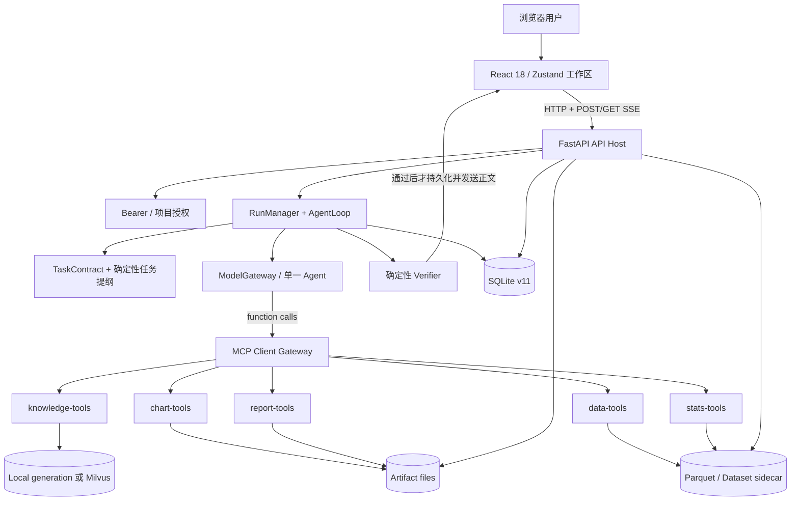
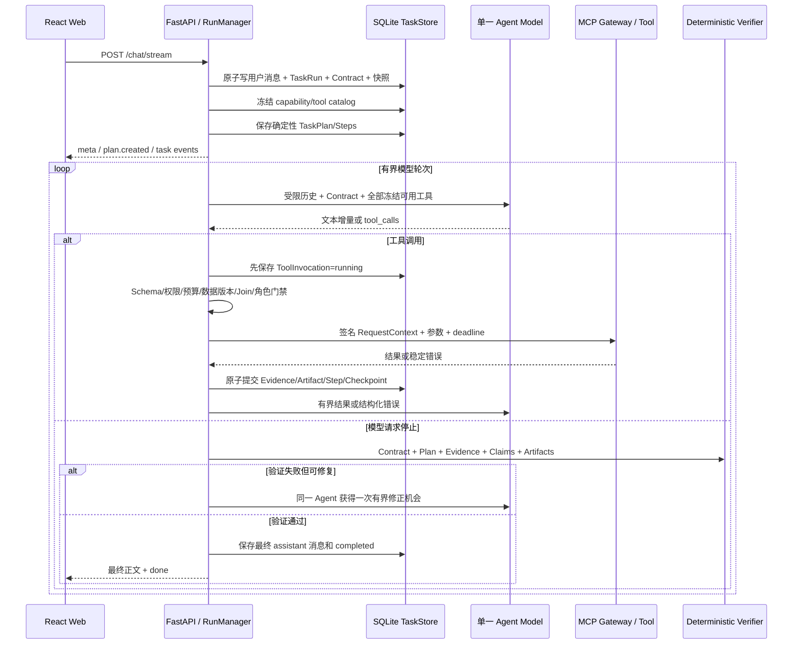

# EXCELChatBI 项目开发交接文档

> 文档基线：`main` 分支，提交 `42f133d`（2026-08-27）
>
> 审阅日期：2026-08-27
>
> 2026-09-28 修复补充：工作区已修复 PDF 资源访问、Web 依赖漏洞、Excel 行数绕过和报告正文数值校验四项问题。当前修复范围、验证结果与剩余限制见 [交接代码审查报告](./CODE_REVIEW_2026-09-28.md) 第 0 节；本文件未更新的测试记录仍是 2026-08-27 的历史记录，不代表本次状态。
>
> 适用版本：`v2.5-closeout` 单机、单租户技术预览
>
> 事实来源：当前仓库的代码、配置、迁移、测试、脚本与本次本地验证。历史文档只用于解释背景，不能覆盖代码事实。

## 1. 如何阅读这份文档

本文刻意区分五种状态，后文所有“已完成”都应按这个口径理解：

| 标记 | 含义 |
|---|---|
| **已实现** | 当前生产代码存在完整调用链，不是只有接口、类型或规划文档 |
| **有测试契约** | 仓库中有自动化测试固定该行为；不等于本次本机已跑完整套件 |
| **部分/实验性** | 有代码但默认关闭、只覆盖有限场景、依赖 fallback，或只用于评测 |
| **已规划未实现** | 仅存在于路线图或设计记录，不应对产品宣称可用 |
| **已知问题/技术债** | 当前代码、构建或本次验证可以确认的风险和缺口 |

最重要的交接结论是：**当前生产执行链没有独立的 LLM Planner，也没有独立的 LLM Replanner。** 2026-08-27 的收尾改造已经把它们从生产路径删除。现在的“计划”是本地确定性任务提纲，用于澄清、进度、审计和依赖表达；真正选择工具的是同一个 function-calling Agent，工具错误也回传给同一个 Agent 修正；最终由确定性 Verifier 决定能否交付。

`docs/v2.4/`、部分 `docs/v2.5/` 实施记录以及总设计文档中的 Planner/Replanner、三档自治模式、公开审批流、生产语义 Verifier 等描述是历史设计，不是当前运行时事实。遇到冲突时，以本文件列出的生产入口及其代码为准。

本次审阅范围包括仓库跟踪的 `apps/`、`packages/`、`mcp_servers/`、`tests/`、`scripts/`、`evals/`、`config/`、`deploy/`、Compose/Docker/Nginx、GitHub Actions、根配置、依赖清单/锁文件和 `docs/`。`.venv`、`node_modules`、`dist`、`.data`、Playwright 报告、Milvus runtime volume 等生成物不属于项目源码；锁文件用于确认解析后的依赖和版本，不把第三方包源码重复当作本项目实现。

## 2. 产品定位与当前状态

EXCELChatBI 是一个中文优先的对话式表格 BI 技术预览。用户在 Web 工作区上传 XLSX、legacy XLS 或 CSV，随后通过自然语言完成数据理解、质量检查、统计分析、可视化、知识问答和报告生成。产品把工具执行过程、证据、产物和任务状态以 SSE 实时展示，并将工作区状态持久化到 SQLite、Parquet 和受控文件目录。

当前适合：

- 单机或单个受信部署域内的 Excel 探索分析；
- 用确定性工具约束大模型的数据分析 Agent 原型；
- 验证任务恢复、证据绑定、MCP 服务拆分、RAG 与数据治理设计；
- 开发与演示中文数据分析工作流。

当前不等同于：

- 企业多租户 SaaS；
- 任意 SQL 或任意代码执行平台；
- 自动得出因果结论的统计系统；
- 完成代表性业务验收的正式 BI 产品；
- 可水平扩展的多实例服务。

### 2.1 当前能力总览

| 能力 | 状态 | 说明 |
|---|---|---|
| 表格上传与画像 | `.xlsx` 主格式、`.xls` 只读兼容、`.csv` 单表导入均有测试契约 | 统一转换为不透明引用的 Parquet，生成画像、质量与角色建议；`.xls` 由 `xlrd 2.x` 读取已保存值 |
| 对话式分析 Agent | 已实现，有测试契约 | 单 Agent function-calling，17 个生产工具，统一入口 `/chat/stream` |
| 任务提纲与控制 | 已实现，有测试契约 | 确定性提纲、步骤状态、暂停/恢复/取消/澄清/单步重试/版本化修订 |
| 统计分析 | 已实现，有测试契约 | 趋势、异常、回归、相关、维度贡献、组间比较、受治理预测 |
| 图表和报告 | 已实现，有测试契约 | ECharts option、Chromium 截图、Markdown/PDF 报告与鉴权下载 |
| 数据变换和 Join | 已实现，有测试契约 | 筛选、排序、清洗、派生数据集；固定等值 Join，必须先预检 |
| Evidence/Claim/Lineage | 已实现，有测试契约 | 工具结果形成 Evidence；数字/知识 Claim 校验；五阶段血缘图 |
| 知识库 | 已实现；有轻量与完整档位 | 本地 hashing/lexical/local 为基线；BGE-M3 + reranker + Milvus 为完整档位 |
| 受控记忆 | 已实现，有测试契约 | 不可变版本、快照、冲突、软删除和明确确认的资源映射；不自动抽取长期记忆 |
| 领域定义 | 后端已实现，有测试契约 | 指标版本、有效期、字段映射、受控公式编译；前端没有管理 UI |
| 多 MCP 服务部署 | 已实现，有契约和 Compose E2E | data/stats/chart/report/knowledge 五个服务，Streamable HTTP |
| 企业认证和多租户 | 未实现 | 只有关闭认证的本地身份或静态 Bearer token；KB 是实例共享资源 |
| 任意 SQL / Code Interpreter | 已规划未实现 | 必须以独立隔离安全项目交付，当前没有可调用工具 |

### 2.2 当前开发阶段

仓库自称进入功能冻结/工程收尾，这在“主要功能链已经存在”层面成立，但不能理解为“无已知问题”或“所有验收均通过”。本次本地验证发现后端完整测试存在可复现阻塞，详见第 15 节。项目仍应视为技术预览；生产化缺口集中在企业身份、持久审计、多实例状态、对象存储、代表性业务验收和前端性能。

## 3. 总体架构



架构分成四个清晰边界：

1. **Web 产品边界**：`apps/web` 只通过 API 操作工作区，不直接访问数据文件、SQLite 或模型。
2. **API/Host 信任边界**：`apps/api` 负责身份、项目作用域、SSE、任务宿主、生命周期和下载；Host 而不是模型决定真实身份、数据版本、权限快照和执行上下文。
3. **Agent 控制边界**：`apps/orchestrator` 负责任务契约、澄清、提纲、工具循环、预算、恢复和最终校验；模型可以提议调用，但不能绕过 Host 约束。
4. **确定性能力边界**：`mcp_servers`、`packages/*` 承担真实计算、存储、治理、RAG 和模型适配。模型输出本身不是数据事实。

### 3.1 运行拓扑

本地轻量开发默认可将 Agent 工具留在进程内适配层；正式 Compose 拓扑则是 API、Web 和五个独立 MCP 服务。`compose.yaml` 把 MCP 服务放在内部网络，只让 Web/API 连接 edge 网络，并为服务设置非 root、只读根文件系统、`no-new-privileges`、`cap_drop`、受限卷和 secrets。

生产/预生产配置有明确 fail-fast：

- API 必须启用 Bearer 认证；
- MCP 必须使用认证的 Streamable HTTP；
- 必须签名 RequestContext；
- 禁止进程内 fallback；
- 五服务路由和 token/secret 必须完整；
- RAG profile 与 embedder/reranker/store/device 必须成套匹配。

Docker API 镜像固定一个 Uvicorn worker。这不是简单的默认值：当前活动 Run Host、对话锁和部分运行控制仍在单进程内存中，SQLite 也不是多实例协调后端。未经架构升级，不应直接增加 worker 或横向副本。

## 4. 代码分层与关键入口

这不是文件清单，而是接手时的定位地图。

| 层 | 关键位置 | 应先理解的职责 |
|---|---|---|
| API Host | `apps/api/main.py`、`apps/api/routers/`、`apps/api/run_host.py` | 生命周期、路由、SSE、权限、恢复、文件下载 |
| Agent | `apps/orchestrator/agent_loop.py`、`run_manager.py`、`agent_tools.py` | 单 Agent 主循环、后台 producer、工具目录 |
| 控制面 | `apps/orchestrator/control/` | TaskContract、任务提纲、调度、Claims、Verifier、Join/假设/角色门禁 |
| MCP 协议 | `mcp_servers/common/`、`mcp_servers/agent_service/server.py` | 契约、目录发现、签名上下文、SDK adapter、五服务路由 |
| 工具实现 | `mcp_servers/{excel_parser,dataset_ops,stats,chart,report}/` | 确定性数据和统计能力 |
| 模型 | `packages/models/`、`config/models.example.yaml` | 模型 registry、fallback、OpenAI 兼容适配、DeepSeek DSML |
| 会话与状态 | `packages/session/` | SQLite v11、迁移、TaskStore、记忆、指代、血缘、备份 |
| 治理 | `packages/governance/` | 数据边界、脱敏、小组保护、工具策略、审计和可观测性 |
| 知识库 | `packages/rag/` | 分块、embedding、稀疏检索、rerank、本地/Milvus 代际发布 |
| 通用数据 | `packages/common/config.py`、`dataset_store.py` | Settings 和不透明 Parquet 数据集存储 |
| Web | `apps/web/src/App.tsx`、`stores/workspace.ts`、`components/` | 工作区初始化、统一状态、SSE、聊天和任务控制界面 |
| 验证与运维 | `tests/`、`apps/web/e2e/`、`scripts/`、`.github/workflows/ci.yml` | 自动测试、质量评测、迁移/恢复/MCP/RAG 运维 |

`apps/orchestrator/agent_loop.py` 超过五千行，是当前最集中的复杂度热点。修改 Agent 行为前，应先读 `control/contracts.py`、`task_outline.py`、`plan_executor.py`、`claims.py` 和 `verifier.py`，否则很容易只修模型提示而破坏持久状态或完成条件。

## 5. 主要业务流程

### 5.1 工作区与表格上传

1. Web 启动后读取认证配置，令牌只保存在浏览器 `sessionStorage`。
2. `workspace.ts` 拉取项目；空工作区会创建首个项目和对话。
3. 浏览器向兼容端点 `POST /upload/excel` 发送 `.xlsx`、`.xls` 或 `.csv`，可同时绑定项目/对话。`.xlsx` 是主格式；`.xls` 仅用于旧文件只读导入；CSV 是单表输入。
4. API 按块读取并执行文件大小限制，清理用户文件名，写入临时文件。
5. 按内容选择工作簿引擎；OOXML 先限制 ZIP 解压总量，再忽略不可信 dimension 流式检查实际行、列及矩形单元格预算；BIFF `.xls` 先按工作表目录检查行、列和单元格预算；CSV 确定性识别 UTF-8（含 BOM）/GB18030 与逗号、分号、制表符或竖线。所有格式最后都有界读取并再次检查。
6. parser 只读取文件中已保存的值并生成画像与字段角色建议；不执行宏、不重算公式。`.xlsx` 所选范围的公式缺少缓存值时明确拒绝；legacy `.xls` 由 `xlrd` 读取已保存结果；CSV 没有工作表或公式语义。
7. 数据写为 UUID 形式的 Parquet，sidecar 保存元数据和治理策略；上传源文件在完成或失败后清理。
8. SQLite 原子注册 Dataset、来源锚点、对话消息和初始 profile Artifact；浏览器随后重新拉取数据集和产物。

数据集引用必须是服务端生成的 32 位不透明标识，绝不能允许模型或客户端传入路径。相关实现集中在 `packages/common/dataset_store.py`、`mcp_servers/excel_parser/`、`apps/api/routers/upload.py` 和 `packages/session/store.py`。

表格默认限制：数据行 500000、OOXML ZIP 解压总量 256 MiB、列数 1024、读取矩形 5000000 单元格；表头/前导行计入单元格预算，中间及格式化空行也计入实际行预算。配置项见根 `.env.example` 的 `LARGE_TABLE_ROW_THRESHOLD`、`EXCEL_MAX_*`。显式 `nrows` 在行数上限内时允许采样，但不能绕过解压、宽度或单元格预算。没有新增可硬终止的解析子进程。

### 5.2 对话与 Agent 执行



`POST /chat/stream` 是唯一聊天/分析入口。旧的单次分析、统计或知识问答 HTTP 入口已经删除。Web 的“自动分析”“趋势”“异常”“图表”等快捷按钮只是在输入框注入自然语言提示词，不对应硬编码工具或独立模式。

一次正常运行的核心阶段如下：

- 解析用户文本、数据集和历史引用；
- 必要时在调用模型前创建结构化澄清；
- 固定 TaskContract、数据版本、memory/compaction 快照和工具目录；
- 本地生成 fast/template 任务提纲；
- 同一个 Agent 在有界轮次内调用冻结目录里的工具；
- Host 原子记录调用、Evidence、Artifact、步骤和 Checkpoint；
- 提取 Claim，验证数字、知识来源、文件、计划终态和 Artifact 后置条件；
- 只在通过 Verifier 后持久化并发送最终助手正文。

### 5.3 澄清、暂停、断线和恢复

阻塞歧义不会靠模型自由发挥，而是进入 `waiting_user`。当前确定性澄清覆盖数据集选择、Join 两表/键/类型、开放式自动分析假设、时间/指标列、Artifact/记忆引用等场景。问题携带 `answer_schema`：枚举项在聊天卡片中显示按钮，开放问题显示文本框。回答通过带 resume token 的 Agent run API 恢复同一个 `run_id`。

同一对话在 SQLite 原子创建层和进程内对话锁层都只允许一个非终态 TaskRun。任务未结束时，Web 锁住普通输入，用户必须完成澄清、恢复或取消；这是防止交叉写消息和 SSE 混流的架构约束。

`RunManager` 将后台 producer 与浏览器订阅解耦。浏览器断开后任务可以继续，SSE 重连先订阅再回放持久事件，以 sequence/事件 ID 去重。浏览器 local/session storage 中的 run ID 只是提示，服务端 `latest run` 才是真相。首个业务事件和后续空闲有独立超时，注释/heartbeat 不计为有效进展。

暂停和取消是**协作式**的：在模型/工具边界检查控制信号，不能安全地硬杀正在进行的外部调用。若写工具超时后结果未知，系统将 Invocation 标记为 `unknown`，禁止自动重试和宣称成功。

API 重启时会恢复陈旧运行态：活动调用转为未知；可恢复的运行根据 Checkpoint 暂停；`waiting_user` 保留。若原进程中的 Run Host 丢失，恢复接口会从 SQLite 的 Contract、计划、目录快照、预算和 Checkpoint 重建。

### 5.4 图表和报告

明确的图表/报告请求会进入 TaskContract 的 Artifact 后置条件。Agent 即使返回漂亮文字，只要当前 run 没有真实文件或图表 Artifact，Verifier 也不会允许完成。

图表工具返回受治理的 ECharts option。折线、柱状、饼图通常先聚合并应用小组保护；散点图和 `agg=none` 路径处理原始点，属于需要继续审视的数据量与隐私边界。截图工具用本地打包的 `echarts.min.js` 和 Playwright Chromium 渲染；当前实现每次调用启动并关闭浏览器，没有真正的浏览器池。

报告不是第二个生成式模型。`generate_report` 是 Host 侧复合工具：从当前对话中选择已有分析/图表 Artifact（可以来自先前运行），必要时生成截图，然后用确定性 formatter 生成 Markdown/PDF，原子发布文件并登记 Artifact。下载端点按报告所有权、项目成员和安全路径校验授权。

2026-09-28 补充：生成前从当前对话的 `analysis_ids` 选定工件建立数值索引，校验标题、要点、图表标题/caption 和统计解读；旧解读、模型参数、未选分析及新报告不能作为数值证据。失败在截图/写文件前返回同一 Agent 修正；成功 Artifact 保存来源数值 hash、匹配引用和 Markdown SHA-256。它复用确定性数值匹配，不是自然语言业务语义验收。

正文中的原始 HTML 按文本转义；PDF HTML 只保留排版标签和受限属性。资源获取仅允许经过大小、像素及 PNG 块校验的内嵌 PNG（每张最多 12 MiB、1600 万像素），拒绝本地文件、HTTP(S)、SVG、附件和任意 CSS。历史已生成报告不会自动重写或重新核验，交接使用的报告应重新生成。

本轮没有新增可硬终止的 PDF 渲染子进程；现有工具超时不等同于进程级时间或内存配额。

### 5.5 知识库生命周期

知识库的事实源和检索索引被刻意分离：

- 原文进入不可变 source store，manifest 保存内容 hash 和版本；
- Markdown 按标题和窗口分块；
- baseline 使用确定性 hashing embedding、lexical reranker 和本地 generation store；
- full profile 使用 BGE-M3 稠密+稀疏向量、BGE reranker 与 Milvus；
- 查询执行 dense/sparse/BM25 候选融合、RRF、rerank 和最低相关度过滤；
- 返回结果携带来源，进入 Evidence，知识 Claim 必须能绑定实际返回来源。

本地 store 通过 generation + active/previous 指针原子换代；Milvus 通过物理 generation collection、加载、指针/alias 切换和旧代清理完成发布。原文发布成功而索引构建失败时，原文仍存在，旧索引继续服务；索引是可重建的派生物。

KB 管理 API 支持 ingest、rebuild、delete 和 overview，但当前知识库是**实例级共享资源**，没有跨租户索引隔离。只适合明确的单租户部署。

## 6. Agent 控制面详解

### 6.1 TaskContract 与任务提纲

TaskContract 是 Host 根据请求构建的最低完成契约，主要表达：目标、数据/引用绑定、必需 Artifact、预算和允许的完成边界。当前解释器对明确图表、报告/PDF、非空回复和部分数据角色要求最强；广泛的自然语言语义覆盖仍有限。

`apps/orchestrator/control/task_outline.py` 生成 fast/template 确定性提纲，不调用 Planner 模型。提纲具备持久化步骤、依赖和 artifact reuse，但它**不是 Agent 工具 allowlist**。每轮模型都获得本次任务开始时冻结且可用的完整工具目录。Agent 可以选择提纲未预先点名但契约兼容的下游工具；Host 随后把实际调用绑定到步骤，并把已被成功下游结果覆盖的前置步骤显式置为 `skipped`，防止“run completed 但 step pending”。

计划校验器会拒绝循环依赖、缺失依赖、不可用能力、违反 Artifact 契约和缺失 Join preflight 的计划。人工修订只允许在暂停边界创建不可变新版本，不能删除或改写已经完成的步骤。

### 6.2 单 Agent function-calling 循环

默认边界在 `AgentLoopConfig` 和 Settings 中：最多 12 次工具调用、16 个模型轮次、最多 4 个可并行工具、整轮 300 秒、单模型 90 秒、单工具 120 秒；配置可调但有上下界。

模型收到：

- 系统安全和证据要求；
- 有界最近历史与确定性压缩摘要；
- 数据集画像和字段角色，不含不必要样本行/宿主路径；
- 已验证引用、固定记忆快照和 Artifact registry；
- 当前 Contract、提纲进度、工具结果和错误；
- 冻结工具的 OpenAI function schema。

模型不应收到真实文件路径、服务令牌、任意 SQL 能力或通用记忆写入能力。DeepSeek 的 DSML 工具表示只在模型适配边界序列化/反序列化，内部始终使用结构化 `ToolCall`，DSML 标记不会直接显示给用户。

工具错误、Schema 错误和数据角色门禁错误会作为 Observation 回到同一 Agent。系统有无效调用上限、重复同工具同参数熔断、总调用预算和最大轮次，避免无限自修正。代码中仍保留 `max_replans` 一类预算命名，但当前没有独立 Replanner 模型；不要因字段名误判生产架构。

### 6.3 受控并行

只有同一 ready frontier、互不依赖、低/中风险、只读、幂等、闭世界且资源不冲突的调用才允许有界并行。异常检测、图表、截图、变换、Join、报告等默认排除在并行集合之外。每个并行分支仍共享同一预算、取消树、数据版本和 Evidence Ledger，Host 按一致事务规则提交结果。

### 6.4 Verifier 与 Claim

生产使用 `apps/orchestrator/control/verifier.py` 的确定性 Verifier，主要检查：

- 任务所需图表/报告是否真实存在且属于当前 run；
- PDF/Markdown 文件是否存在、非空并与登记一致；
- 计划是否无独立 pending/running 步骤；
- 未知或未被后续成功覆盖的失败调用是否存在；
- 数值 Claim 是否能指向 Evidence 的具体值路径；
- 百分号及千/万/亿单位换算、常规显示舍入是否可确定性匹配；
- 知识结论是否有实际检索来源；
- 领域定义结论是否绑定精确版本和编译后的数据 Evidence；
- 限制和失败是否被如实表达。

首次验证失败时，同一 Agent 可以得到一次有界修正机会；仍不收敛时，系统确定性修复不受支持的陈述，或以 failed/blocked 终止。模型“停止生成”从来不等于任务完成。

`apps/orchestrator/control/semantic_verifier.py` 和 `scripts/agent_verifier_eval.py` 存在，并有单元/离线评测，但当前生产 `verify_completion` 不传 semantic checker。它属于**实验/评测代码，不是已上线语义验证器**。

### 6.5 开放式自动分析

“自动分析”“看看有什么异常”之类开放请求先由确定性 hypothesis screening 生成最多四个候选。候选只能基于画像，状态明确为“未检验”，用于缩小后续分析范围，不能直接写成事实。当前实现不会后台自动扩展无限探索；后续建议会提示用户开显式分析分支。

## 7. 生产 Agent 工具目录

Agent 面向的目录严格是 17 个工具。内部 server 还存在 Excel 解析器、report formatter 等更低层工具，但它们不是模型可以直接调用的 17 个生产工具，统计工具数量时不要混淆。

| MCP 服务 | Agent 工具 | 能力与边界 |
|---|---|---|
| `data-tools` | `get_data_profile` | 行列、类型、缺失、重复、字段角色和安全质量建议；只读 |
|  | `transform_dataset` | 筛选、排除列、去空/去重、稳定排序，生成新 Parquet |
|  | `aggregate_preview` | 分组聚合预览；聊天预览当前明确豁免小组保护 |
|  | `join_preflight` | 两表键类型、基数、空值、匹配率、估算行数和风险；只读 |
|  | `join_datasets` | 固定等值 inner/left/right/outer Join，要求精确预检和固定数据版本 |
| `stats-tools` | `trend_analysis` | 移动平均/STL，装有 Prophet extra 时可用探索性 Prophet 路径 |
|  | `anomaly_detect` | IQR 或 Isolation Forest，输出异常候选与限制 |
|  | `regression` | OLS、显著性和残差/共线性等诊断；不允许因果表述 |
|  | `correlation` | Pearson/Spearman、完整样本排除说明 |
|  | `dimension_contribution` | 维度贡献和覆盖率，小组抑制/合并 |
|  | `group_compare` | Welch t/ANOVA、Holm 校正、效应量和零方差失败关闭 |
|  | `forecast` | naive/drift/seasonal-naive 的时间 holdout 选择、基线、区间和泄漏保护；需启用 forecast capability profile |
| `chart-tools` | `gen_chart` | line/bar/pie/scatter 的 ECharts option 和 Chart Artifact |
|  | `chart_screenshot` | 本地 Chromium 渲染 PNG，生成截图 Artifact |
| `report-tools` | `generate_report` | 组装既有 Evidence/Artifact，确定性生成 Markdown/PDF |
| `knowledge-tools` | `kb_search` | RAG 检索，返回可追踪 source/citation |
|  | `domain_definition_lookup` | 解析精确领域定义版本并加入 Evidence Ledger |

所有工具 schema、能力、风险、权限、artifact 类型、只读性、幂等性和 contract hash 由 MCP 契约单源定义。任务开始后保存内容寻址的目录快照；运行中新增工具只对新任务可见。恢复时若冻结工具缺失、版本/hash/服务路由漂移，任务失败关闭，不能静默换工具。

当前目录没有必须人工审批的 high/critical 生产工具。SQLite v7 的 ApprovalRecord 和 RequestContext 的 approval 字段为了历史数据库兼容保留，公开审批 API、前端审批 UI 和等待审批执行路径已经删除。

## 8. 数据、状态与持久化

### 8.1 三类持久化事实

| 类型 | 实现 | 事实角色 |
|---|---|---|
| 业务状态 | SQLite v11，`packages/session/` | 项目、成员、对话、消息、Dataset 元数据、Artifact、TaskRun、计划、Invocation、Evidence、Claim、Checkpoint、记忆、定义、血缘 |
| 分析数据与文件 | Parquet + sidecar、报告/截图目录 | 数据集和可下载产物；数据库只登记受控引用，不保存整表 |
| 知识库 | source manifest + local generation 或 Milvus | 原文是事实源，索引是可重建派生物；与工作区备份分开 |

SQLite 使用短连接、外键和 `busy_timeout`，核心跨表操作由 `TaskStore` 显式事务实现。缓存和内存 Run Host 都是派生状态，不能比 SQLite 更权威。

### 8.2 SQLite schema 演进

启动会检查 `PRAGMA user_version`、迁移 checksum、关键表、数据库 `quick_check` 和血缘一致性。受支持的旧库自动先生成带时间戳和 hash 的备份，再按顺序迁移。非空但无版本、未知版本或 checksum 漂移会失败关闭。

| 版本 | 主要变化 |
|---|---|
| v1 | 项目、对话、消息、Dataset、Artifact 等工作区核心表 |
| v2 | TaskRun、Contract、Event、Plan/Step、Invocation、Evidence、Claim、Checkpoint |
| v3 | 项目成员与报告发布/所有权 |
| v4 | 受控 Memory、不可变版本、冲突/软删除/幂等操作 |
| v5 | ConversationCompaction 与精确来源覆盖 |
| v6 | Dataset 来源锚点、删除 tombstone 和血缘恢复约束 |
| v7 | 历史 ApprovalRecord 兼容结构；现行执行不使用公开审批流 |
| v8 | 领域定义、版本、有效期、字段映射和定义绑定 |
| v9 | 每个 TaskRun 的不可变 capability/tool catalog 快照 |
| v10 | 执行作用域、数据版本绑定、取消树和 Evidence Ledger 版本 |
| v11 | 多父 Dataset 血缘和 Join 双父版本绑定 |

迁移代码在 `packages/session/migrations/`，不能通过直接编辑建表 SQL“修现有库”。新增持久字段必须增加新迁移、checksum、旧库 rehearsal、备份/恢复清单和 readiness 测试。

### 8.3 TaskRun 事务不变量

以下顺序是系统可信性的核心，不能为了简化调用而打乱：

1. 用户消息、TaskRun、TaskContract、目标和初始快照原子创建；失败不能留下孤立消息。
2. 同一 conversation 只能原子创建一个活动 TaskRun。
3. 工具开始前先持久化 Invocation 和执行上下文，再发出外部副作用。
4. 工具成功、Artifact、Evidence、`step.completed`、Checkpoint 和事件原子提交。
5. 事务失败时清理尚未被引用的文件；已进入 Evidence 的文件不能随意删除。
6. TaskRun、Plan 和控制 API 使用 `state_version`/`If-Match` 做乐观并发。
7. 重试、澄清回答、记忆修订等写操作使用 idempotency key。
8. 完成事务同时检查步骤闭合，不能只改 run 状态而遗留 pending step。

### 8.4 数据集存储与血缘

`packages/common/dataset_store.py` 将 DataFrame 写成不透明 UUID Parquet，DuckDB 负责部分聚合、筛选和 Join 下推。变换生成新的 Dataset，不覆盖父数据；Join 生成具有两个 parent edge 的派生 Dataset，并继承两侧更严格的数据策略。

项目血缘 API 从现有事实表派生稳定图，而不是维护另一份可漂移图缓存。前端展示五阶段关系：

```text
Dataset → Analysis/Invocation → Artifact → Evidence → Claim
```

图查询按 tenant/project/conversation 限界，响应不包含原始工具参数、文件路径、记忆正文或密钥。删除 Dataset 会写 tombstone；已被使用或有派生子节点时默认拒绝，需要显式 force，并保留可解释的历史边。

### 8.5 记忆、压缩与指代

Memory 不是聊天全文缓存，而是受治理的不可变记录：

- scope：conversation、project、subject；
- kind：alias、preference、decision、mapping、summary 等；
- 每次修订创建新版本，旧版本不改写；
- 冲突、过期、低置信度、删除项不进入有效快照；
- policy 拒绝 secret、宿主路径等危险正文；
- 创建、修订、删除和拒绝产生不含正文的结构化审计。

当前没有自动长期记忆抽取，也没有暴露通用 `memory.write` 给模型。只有 `memory-reference-v1` 可以把用户明确确认的唯一资源映射绑定到 Dataset/Artifact；要求当前有效、无冲突、达到置信阈值、资源链接唯一且快照固定。恢复时资源漂移会失败关闭。

长对话压缩使用确定性的 extractive-v1，不调用摘要模型。压缩保存精确覆盖消息 ID、策略参数和 hash，并脱敏 secret/路径。压缩摘要只是导航上下文，永远不能替代 Evidence。

指代解析同样是确定性的，支持精确 ID/名称、序数、最近项和部分中文指示语。多解时进入澄清；成功绑定只保存紧凑 Host hash，并在恢复时重新验证。

### 8.6 领域定义

领域定义后端支持指标的不可变版本、有效日期、冲突检测和字段映射。重叠有效定义不会“猜一个获胜者”，而是返回冲突。公式 DSL 只允许受控的 `aggregate_preview` 语义概念（group/value、sum/mean/count、sort、limit），不接受 SQL 或 Python。

执行时 Host 把定义概念编译为当前数据集字段，固定定义版本、字段映射和参数 hash；结果 Evidence 同时绑定定义 Resource 和数据 Evidence。报告可以回查历史精确版本。API 位于 `apps/api/routers/domain_definitions.py`，资源协议位于 knowledge MCP；Web 当前没有创建、修订或映射定义的界面。

### 8.7 备份与恢复

`apps.api.workspace_admin` 和 `packages/session/workspace_backup.py` 提供离线工作区备份、校验和精确恢复：

- 必须显式声明服务已停止；
- manifest 校验 SQLite schema、迁移 checksum、表行数、血缘，以及每个 Dataset/Artifact 文件 hash；
- 恢复前生成 `pre-restore-*` 副本；
- 替换文件需要显式 `--replace-files --yes`；
- 恢复后的引用和 hash 不一致时 readiness 失败。

知识库不在工作区备份内，必须单独用 `kb_admin`/Milvus 流程备份。在线复制 `.data` 不构成一致备份。

## 9. 模型调用机制

### 9.1 Registry 与路由

`packages/models/registry.py` 从 YAML 加载模型定义，支持环境变量展开、scenario 路由、候选 fallback、价格和能力标记。示例配置 `config/models.example.yaml` 包含 core、complex、vision、lightweight、agent 等路由，默认对话 Agent 使用 `agent` scenario。

模型条目需要明确 provider、base URL、model、key、是否支持 tools、上下文和价格。配置中的密钥只以环境变量引用存在，不应写入 YAML 或日志。

### 9.2 Gateway 行为

`ModelGateway` 提供 complete、stream 和结构化 `stream_turn`。如果调用需要 tools，会跳过不支持 function-calling 的候选。流开始前可以切换 fallback；一旦向上游发送了有效流增量，就不再静默换模型，以免把两个模型的内容拼接成一个响应。

模型和总任务有独立 timeout。外部模型故障只应形成稳定错误和 failed/可重试状态，不应保存半截 assistant 消息。

OpenAI-compatible adapter 会聚合流式 tool call 的 name/arguments；DeepSeek adapter 在 provider 边界转换 DSML。工具名和参数仍需经过冻结目录与 JSON Schema 校验，provider 返回的原始 tool call 不是授权。

### 9.3 模型可见数据边界

模型只接收完成任务所需的有限视图：列类型、统计摘要、少量受治理结果和截断后的工具输出。上传原始文件路径、SQLite 路径、服务 token 和审计内部字段不进入 prompt。统计工具负责计算，模型只负责选择能力和解释；禁止模型凭表面样本自行计算完整结果。

外部 provider 的真实可用性、延迟和中文表现不由确定性 CI 保证。E2E 用 `apps/e2e_model` 替换的只是外部非确定模型边界，其余 Web/API/Agent/MCP/SQLite/Parquet/报告链仍是真实实现。

## 10. MCP 工具系统

### 10.1 契约与发现

`mcp_servers/common/contracts.py` 定义 `ToolCapabilityMetadata` 和 `MCPRequestContext`。每个工具必须有：

- JSON input/output schema；
- capability、版本和 contract hash；
- risk、required permissions；
- artifact types；
- read-only、idempotent、destructive/open-world 元数据。

Client Gateway 用官方 SDK 执行 `tools/list`/`tools/call`。启动和任务恢复会验证远端目录；契约漂移使 gateway unhealthy，并对旧任务失败关闭。MCP 协议版本固定为 `2025-11-25`，请求体上限 1 MiB。

### 10.2 RequestContext 与权限

API Host 生成并 HMAC 签名 RequestContext，包含 tenant、subject、project、conversation、run、plan、step、invocation、idempotency、权限快照、memory snapshot、Evidence ledger 版本、数据版本、deadline 和 cancellation。模型不能填写这些字段。

服务端验证签名、时间、必填 ID 和 contract hash，再校验项目/对话/Dataset 作用域。五个内部 MCP 服务共享服务级 token 只用于服务认证；用户身份来自 Host 的签名上下文，token 本身不能充当最终用户。

### 10.3 传输和故障语义

支持三种 adapter：

- `in_process`：本地开发/测试兼容；部署禁用 fallback；
- `stdio`：本地独立进程；
- `streamable_http`：Compose/部署使用，带 Bearer、Host/Origin 与 DNS rebinding 防护。

Gateway 只对确认无副作用的只读幂等调用做有限重连。写调用在网络超时后可能已生效，因此必须记为 unknown，不能自动再发。resources list/read/subscribe 和签名游标也已实现，用于定义和服务资源恢复。

### 10.4 新增工具的正确路径

新增工具不是在提示词中加名字。至少要同步完成：

1. 在工具实现层定义确定性行为和失败语义；
2. 定义严格 input/output schema；
3. 添加 capability/risk/permission/artifact/idempotency 元数据；
4. 加入唯一 Agent 工具目录和正确的五服务分区；
5. 更新 Host 参数 enrich/治理/后置条件（如需要）；
6. 更新 TaskContract/outline 能力映射，但不要把 outline 变成工具 allowlist；
7. 补上 in-process、stdio/HTTP 等价、契约漂移、恢复和 Evidence 测试；
8. 更新 Compose secrets、health 和部署探针。

缺少上述任一环节的“工具”都不应公开给 Agent。

## 11. 确定性数据与统计实现

### 11.1 数据画像和角色建议

Excel profile 输出行列数、类型、空值率、基数、有限样本值和重复行数。样本上限很小，并经过 governance redaction。字段角色 advisor 根据列名、类型和基数给出 time/dimension/measure/identifier 候选、置信度和歧义；它只给建议，不自动清洗或改变用户数据。

### 11.2 数据变换和聚合

`transform_dataset` 支持排除列、条件筛选、删除空值/重复、稳定排序，拒绝空结果并写新 Dataset。`aggregate_preview` 使用 DuckDB 做聚合，默认/最大行数受 schema 限制。

需要特别注意：`aggregate_preview` 代码明确把聊天预览列为小组保护例外，而图表和多数统计工具会应用小组抑制/合并。这是当前产品决策，不代表已经完成企业隐私评审。

### 11.3 Join

Join 只支持固定等值连接。preflight 检查键类型族、null、基数、重复、匹配率、估算行数和固定上限；多对多会给风险提示。实际 Join 必须与同一 run 中成功 preflight 的两表、键、join type 和数据版本完全一致。输出列名冲突使用固定后缀，派生策略取两侧更严格者。

当前多对多风险在 preflight 后不会进入人工审批，而是在非阻塞警告和硬上限内自动执行。这与已删除的审批模式一致，但在真实大数据接入前应重新做资源风险评估。

### 11.4 统计工具

- `trend_analysis`：移动平均、STL；Prophet 是可选 extra 的探索性实现，能处理重复日期，但结论必须说明限制。
- `forecast`：与 Prophet 趋势路径不同，是受治理预测能力。要求规则时间戳、无重复、验证窗口覆盖 horizon；在 chronological holdout 上比较 naive/drift/seasonal-naive，输出基线、误差、经验 95% 区间、泄漏标志和可靠性。
- `anomaly_detect`：IQR 或 Isolation Forest，只识别异常候选，不推断根因。
- `regression`：OLS、系数/显著性、正态性、异方差、自相关、VIF/秩和样本量保护；禁止把相关回归写成因果。
- `correlation`：Pearson/Spearman 和 complete-case 排除说明。
- `dimension_contribution`：维度占比、覆盖率和小组保护。
- `group_compare`：Welch t 或 ANOVA、Holm 多重校正、效应量；零方差等情况失败关闭。

统计结果都带 `statistical_evidence`、方法、样本数和 limitations；Agent 系统提示明确禁止无工具依据数字、因果夸大和把探索性候选写成已证实事实。

## 12. 治理、安全与隔离

### 12.1 身份与授权

`AUTH_MODE=disabled` 时使用固定本地 principal；Bearer 模式从静态 token registry 映射 user/tenant/role。项目成员角色为 owner/editor/viewer，资源访问从项目逐层校验。无权限资源通常返回 404，减少枚举泄漏。

这套实现能固定单实例授权边界，但没有 OIDC/OAuth、登录会话、token 生命周期、成员管理 API、企业组织模型或跨租户知识索引。Web 的登录页只是录入静态 token，token 只放 `sessionStorage`。

### 12.2 数据策略

数据策略来自配置和 Dataset sidecar 的叠加，列级策略包括 normal/mask/exclude，数据集级包括 open/internal/restricted。模型样本、工具输出和 profile 通过统一 redaction；图表/统计使用 small-group merge/drop。工具策略还检查项目内已登记资源、allowlist、预算和参数 hash。

当前默认 data policy 较宽松；如果部署处理真实敏感数据，必须显式提供 `config/data_policy.yaml` 并审视 `aggregate_preview`、scatter、`agg=none` 等例外路径。

### 12.3 审计与日志

结构化日志和 trace 能记录工具元数据、策略结果、调用状态、memory 操作和 gateway 健康，参数正文通常只保存 hash 或安全视图。真正不可变的业务证据在 SQLite 的 Event/Invocation/Evidence/Claim 表。

`packages/governance/audit.py` 当前主要输出结构化日志，不是企业级 append-only/WORM 审计库。日志留存、集中采集、签名和告警需部署方另行建设。

### 12.4 文件与容器安全

- 上传文件名 basename 化，大小/行数限制，临时源文件清理；
- Dataset/Artifact/Report 都用服务端 ID 解析安全路径；
- KB 本地导入路径必须位于白名单；
- 容器使用非 root、只读根、tmpfs、最小卷、内部网络和 secrets；
- Nginx 不代理 `/mcp` 到公网，SSE 关闭 buffering，并设置常规安全响应头。

普通 Docker 容器不等于代码沙箱，因此仓库没有把 SQL/Python 任意执行伪装成已完成能力。

## 13. 前端实现

### 13.1 状态模型

前端是 React 18 + TypeScript + Vite + Zustand。`apps/web/src/stores/workspace.ts` 是主要客户端状态中心，保存项目、对话、消息、数据集、Artifact、当前 TaskRun、事件和 UI loading/error。SQLite 始终是服务端事实源，浏览器状态可以丢弃后重建。

`apps/web/src/api/client.ts` 封装鉴权 fetch 与 SSE parser。POST chat 和 GET reconnect 都支持 CRLF、chunk、多行 data、Last-Event-ID 和 sequence 去重。完成后 store 重新读取对话、Artifact 和 Dataset，避免只靠增量事件维护复杂一致性。

### 13.2 用户可见能力

- 工作区、项目、对话和 Dataset 选择；
- 表格上传、数据集改名/删除/设为当前上下文；
- 统一聊天和快捷提示词；
- 结构化 enum/text 澄清和取消；
- profile、角色、质量、chart、table、统计、forecast、report、citation 卡片；
- TaskRun 状态、版本、预算、计划、步骤、MCP 服务/权限/健康、Evidence；
- pause/resume/cancel、暂停边界的计划修订、失败步骤重试；
- Join 风险、假设候选、建议分析分支、分支对比和追加反馈；
- 记忆查看、不可变修订、软删除；
- Dataset → Invocation → Artifact → Evidence → Claim 血缘；
- KB ingest/rebuild/delete/overview。

快捷按钮不改变 Agent 模式，也不直接调用工具。例如“自动分析”只是发送自然语言模板。排查快捷入口故障时必须沿普通 chat → Agent → tool → Verifier 全链路检查，不能只修改按钮或一个提示词。

### 13.3 前端边界和缺口

- 没有领域定义/字段映射管理 UI；只能调用 API 或编写管理客户端。
- KB 管理入口会展示给浏览器用户，最终权限仍由 API `kb_admin` 校验；UI 缺少完善的按角色隐藏。
- 当前核心状态和大部分页面集中在少数大型文件，维护成本较高。
- 生产构建主 JS chunk 约 1.432 MB（gzip 468 KB），Vite 明确给出超大 chunk 警告；ECharts、报告/审计面板尚未动态拆包。
- 没有 React 组件级/状态单元测试，前端主要依赖 TypeScript、lint、build 和 Playwright。

## 14. 配置、依赖与部署

### 14.1 运行时要求

- Python `>=3.11,<3.12`；
- Node.js 20、pnpm 9；
- 方案 B/C 需要 Docker Engine/Compose；
- 对话 Agent 需要有效模型 API key；
- 截图需要 Python Playwright Chromium；
- 完整 CPU BGE/Milvus 建议至少 16 GiB 内存和约 5 GiB 模型磁盘。

核心 Python 依赖包括 FastAPI/Uvicorn/SSE、Pydantic、OpenAI/httpx、pandas/openpyxl、DuckDB、statsmodels、scikit-learn、jsonschema、jieba 和 structlog。可选 extras：

| extra | 用途 |
|---|---|
| `forecast` | Prophet 探索性趋势预测路径 |
| `rag` / `rag-store` | FlagEmbedding、transformers、pymilvus 等完整 RAG |
| `chart-screenshot` | Python Playwright 截图 |
| `report` | WeasyPrint/Markdown/PDF |
| `mcp` | 固定版本 MCP SDK |

`uv sync` 会按本次声明精确同步环境，extras 不是逐次累加。需要多项能力时应在一条命令中同时声明，或使用 `--all-extras`；之后可用 `uv run --no-sync` 防止无意改动环境。

### 14.2 方案 A：轻量本地开发

从仓库根目录：

```bash
cp .env.example .env
cp config/models.example.yaml config/models.yaml
cp config/data_policy.example.yaml config/data_policy.yaml
uv sync
pnpm --dir apps/web install
```

确保 `.env` 的 RAG 是完整的一组，而不是混合 profile：

```dotenv
RAG_EMBEDDER=hashing
RAG_RERANKER=lexical
RAG_STORE=local
RAG_RUNTIME_PROFILE=baseline
EMBEDDING_DEVICE=cpu
```

配置 `DEEPSEEK_API_KEY` 和模型 registry 后分别启动：

```bash
# 终端 1
uv run uvicorn apps.api.main:app --reload --host 127.0.0.1 --port 8000

# 终端 2
pnpm --dir apps/web dev --host 127.0.0.1 --port 5173
```

访问 Web `http://127.0.0.1:5173`、API 文档 `http://127.0.0.1:8000/docs`、readiness `http://127.0.0.1:8000/health/ready`。

### 14.3 方案 B：本机 BGE + Docker Milvus

安装 `rag` extra，按 `docs/本地完整BGE与Milvus启动指南.md` 侧载模型和引导 Milvus 权限。Milvus/etcd/MinIO 在 Docker，API 和 Web 在宿主机。完整 BGE API 不要使用 `--reload`，否则可能加载两份模型。日常顺序是 Milvus readiness → API readiness → Web；原文变更后通过已加载模型的 API 或 `scripts/kb_rebuild.py` 重建索引。

### 14.4 方案 C：根 Compose

```bash
docker compose up --build -d
docker compose ps
curl --fail http://127.0.0.1:8080/api/health/ready
```

根入口默认是 `http://127.0.0.1:8080`。`compose.rag.yaml` 叠加 Milvus，`compose.rag.cpu.yaml`/`compose.rag.gpu.yaml` 选择设备，`compose.e2e.yaml` 使用确定性模型 fixture。部署细节见 `docs/全栈部署与E2E.md` 和 `docs/知识库部署与运维.md`。

### 14.5 配置 fail-fast 与漂移

`packages/common/config.py` 使用 Pydantic Settings 并读取 `.env`。RAG 配置必须匹配：

- baseline = `hashing + lexical + local`；
- cpu/gpu = `bge + bge + milvus`，device 分别为 cpu/cuda。

本次验证实际遇到：工作区 `.env` 是 CPU full profile，若测试命令只在 shell 中覆盖三个 RAG 组件为 baseline、却不同时设置 `RAG_RUNTIME_PROFILE=baseline`，Settings 会正确拒绝启动。写本地/CI 命令时必须覆盖完整组合。

`.env.example` 仍保留少量 Redis/Postgres/MinIO “预留”变量，而当前 Settings 不消费其中部分字段（extra 被忽略）。这属于配置文档漂移；不要把出现于 `.env.example` 误当成已经接入外部状态后端。

## 15. 测试、质量门禁与本次验证

### 15.1 测试分层

本仓库当前可收集 **648 个 Python 测试**，另有 **22 个 Playwright `test(...)`**。主要覆盖：

| 层级 | 位置 | 覆盖重点 |
|---|---|---|
| 单元/契约 | `tests/test_agent_claims.py`、`test_agent_verifier.py`、`test_task_outline.py` 等 | Claim/Evidence、Verifier、计划、schema、边界函数 |
| Agent 集成 | `tests/test_agent_loop.py`、`test_run_manager.py`、`test_task_store.py` | function-calling、错误回传、任务事务、控制、恢复、并发 |
| 工具 | `test_dataset_ops.py`、`test_stats_tools.py`、`test_chart_screenshot.py`、`test_report.py` | 数据、统计、图表、报告真实行为 |
| 安全/治理 | `test_auth_isolation.py`、`test_api_hardening.py`、`test_governance_*`、`test_data_boundary.py` | 授权、上传、脱敏、策略、路径和资源隔离 |
| RAG | `test_rag_*`、`test_kb_lifecycle*` | 分块、稠密/稀疏检索、generation、Milvus、生命周期 |
| 状态/恢复 | `test_session_store.py`、`test_migration_rehearsal.py`、`test_workspace_backup.py`、`test_lineage*` | 迁移、备份、恢复、血缘、文件一致性 |
| 浏览器 | `apps/web/e2e/workspace-artifacts.spec.ts` | mock API 下的大量 UI/SSE/控制边界 |
| 本机全栈 | `full-stack.spec.ts` | 真实 API/SQLite/Excel/lineage，外部模型边界可控 |
| Compose | `compose-full-stack.spec.ts`、`compose-recovery.spec.ts` | 真实 Web/API/MCP/Parquet/报告和重启/离线恢复 |

测试中的 `ScriptedGateway` 或 e2e model 只替换不确定的外部模型行为，不能把所有相关测试称为“真实商业模型验收”。反过来，Compose E2E 不使用浏览器网络 mock，MCP、工具、存储和文件链是实际运行的。

### 15.2 确定性质量脚本

CI 除 pytest 外还运行多个数据集门禁：

- `compaction_quality_eval.py`：压缩覆盖、脱敏和稳定性；
- `coref_quality_eval.py`：指代消歧与恢复；
- `lineage_quality_eval.py`：五阶段血缘和漂移；
- `data_role_quality_eval.py`：字段角色与质量建议；
- `hypothesis_exploration_eval.py`：候选边界、限制和可复现性；
- `forecast_quality_eval.py`：时间切分、基线、泄漏和可靠性；
- `join_quality_eval.py`：预检、双父、策略和恢复；
- `kb_eval.py`：检索质量和引用；
- `mcp_transport_probe.py`：Tool/Resource 的 stdio/HTTP 协议等价；
- `migration_rehearsal.py`：真实旧库迁移与恢复；
- `api_startup_smoke.py`：干净核心环境 import/lifespan/readiness。

`stage2_behavior_eval.py`、`v23_baseline_eval.py` 和部分 v2.4/v2.5 fixture 保留历史协议可复现性。`agent_verifier_eval.py` 是语义 Verifier 离线评测，不代表生产启用。

### 15.3 CI 真实结构

`.github/workflows/ci.yml` 有三个 job：

1. **backend**：干净核心环境启动烟测、pytest、确定性质量门禁、MCP probe、轻量 KB 门禁、Ruff 和 Compose 配置校验；
2. **frontend**：pnpm 安装、TypeScript lint、生产 build、Playwright；
3. **containers**：构建非 root API/Web 镜像，并运行真实 Compose 浏览器、服务重启和离线恢复门禁。

CI 当前**没有执行 MyPy**，尽管 README 的手动检查段列出了 `mypy .`。不要把历史文字中的“MyPy 通过”自动延伸到当前提交。

### 15.4 本次本地验证结果

在提交 `42f133d`、当前工作区依赖环境上实际得到：

| 命令/检查 | 结果 |
|---|---|
| `.venv/bin/ruff check .` | **通过**：`All checks passed!` |
| `pnpm lint`（`apps/web`） | **通过** |
| `pnpm build`（`apps/web`） | **通过**；主 JS 1,432.04 kB，gzip 468.06 kB，并有 chunk size 警告 |
| `pytest --collect-only -q` | **通过**；收集 648 项 |
| Claims + Verifier + Outline + TaskStore 核心子集 | **通过**；78 项通过，5.56 秒 |
| 完整 `pytest -q` | **不能记为通过**；见下方阻塞 |
| `mypy .` | **未完成**；扫描到本机 `deploy/milvus/volumes/etcd/member` 时因权限拒绝退出 |
| `mypy apps packages mcp_servers scripts` | **失败**；源码范围避开 volume 后发现缺少 `types-PyYAML` stub（174 个源码文件中 1 个错误） |

后端验证确认了两个不同问题：

1. **本地 RAG 环境组合误用**：当前 `.env` 是 `RAG_RUNTIME_PROFILE=cpu` 的完整档位。如果命令只覆盖 `RAG_EMBEDDER/RERANKER/STORE` 为轻量实现、没有同时覆盖 profile，Settings 会以“cpu/gpu 必须使用 bge/bge/milvus”失败。这是正确的 fail-fast，不是业务回归。完整测试应使用干净 CI 环境，或成组覆盖 `RAG_RUNTIME_PROFILE=baseline`。
2. **修正 profile 后仍有可复现测试阻塞**：`tests/test_agent_loop.py::test_executor_uses_mcp_context_and_transports_have_equivalent_evidence` 单独运行超过 90 秒不结束；`tests/test_api_hardening.py::test_upload_filename_traversal_is_basenamed` 也能单独停在 Starlette `TestClient.post`，20 秒 faulthandler 显示主线程等待 portal、portal 事件循环无进展。为遵守本任务“不修改业务代码”，本次只记录，没有继续打补丁。

README 第 102–103 行已经记录旧的 `test_agent_loop.py` 在当前 WSL 停于 `run_in_threadpool(reference_resolver.resolve)`，但本次还观察到 TestClient 上传等待，因此不能只把问题归为一个历史 Agent 用例。接手后的第一优先级应是在**无仓库 `.env`、干净 `uv sync --frozen`** 环境重跑 CI 命令，确认它是本地 AnyIO/线程池/依赖状态问题还是当前提交回归；在此之前，不应声称当前后端全集全绿。

为避免 `mypy .` 扫描 Docker runtime volume，可先用明确源码范围运行，例如：

```bash
uv run mypy apps packages mcp_servers scripts
```

更长期应在 MyPy 配置中排除 `deploy/**/volumes`、`.data` 等运行目录，补齐 `types-PyYAML` 或明确忽略策略，并让 CI 真正执行约定的检查。

### 15.5 常用验证命令

```bash
# 干净轻量配置（若仓库 .env 是 full profile，必须完整覆盖）
MODEL_REGISTRY_PATH=config/models.example.yaml \
RAG_RUNTIME_PROFILE=baseline \
RAG_EMBEDDER=hashing RAG_RERANKER=lexical RAG_STORE=local \
uv run --frozen pytest -q

uv run --frozen ruff check .
# 当前需先补齐 types-PyYAML；见 15.4
uv run mypy apps packages mcp_servers scripts

pnpm --dir apps/web lint
pnpm --dir apps/web build
pnpm --dir apps/web test:e2e

# 生产拓扑门禁
./scripts/run_compose_e2e.sh
```

单元测试通过不能替代 Compose 门禁；反之，Compose 通过也不能替代确定性统计和安全边界测试。涉及迁移、工具契约、SSE 或恢复的改动至少应同时跑对应单元/集成、MCP probe 和恢复/E2E。

## 16. 调试与故障定位手册

### 16.1 启动和 readiness

排查顺序：

1. `packages/common/config.py` 的 Settings 是否构造成功；
2. `config/models.yaml` 路由、provider URL 和 key 是否存在；
3. RAG profile 是否为完整匹配组合；
4. `GET /health/ready` 返回的 SQLite、模型、RAG、MCP 子状态；
5. Compose 中五个 MCP 服务的 health、token secret 和内部 DNS；
6. 本地 BGE 是否因 `--reload` 加载两份、Milvus RBAC 是否允许 collection 管理。

启动 lifespan 会执行数据库迁移/readiness、陈旧 TaskRun 恢复、报告 Artifact 对账和临时图表清理。readiness 失败不应通过跳过 lifespan 来“解决”。

### 16.2 对话没有回复或 UI 一直生成中

按同一个 `run_id` 逐层检查：

1. 浏览器 Network 中 `POST /chat/stream` 是否收到 `meta` 或错误；
2. `GET /agent/runs/by-conversation/{id}/latest` 的服务端状态；
3. `GET /agent/runs/{run_id}/events` 的最后 sequence；
4. SQLite TaskRun、PlanStep、ToolInvocation 和 Checkpoint 是否一致；
5. 是否处于 `waiting_user`，`answer_schema` 是否能被前端渲染；
6. 是否存在 running/unknown Invocation，或模型/工具 timeout；
7. RunManager 是否仍有后台 producer；丢失时能否从 checkpoint 重建；
8. 前端是否把 heartbeat 误当成业务事件——当前 parser 已避免这一点，改动时需保持。

不要只看最终聊天气泡。Agent 的真实状态在 SQLite run/event/invocation/evidence 中，SSE 只是传输视图。

### 16.3 “未执行：计划步骤尚未就绪/本轮已调用”

这类问题涉及 outline 与真实 tool call 的调度绑定，定位：

- `control/task_outline.py` 是否生成了正确依赖；
- `control/plan_executor.py` 的 ready frontier；
- `agent_loop.py` 的 tool-call reconciliation 是否把 Agent 实际选择绑定到步骤；
- prerequisite 是否已经被下游成功覆盖，应否显式 `skipped`；
- 同轮重复调用/同参熔断是否误判；
- Verifier 是否看到独立 pending step。

当前设计允许 Agent 选择未就绪的兼容下游能力并由 Host 调和，不能回退为“outline 没列出就禁止调用”，否则会重新引入之前自动分析、图表和异常分析被计划器卡死的问题。

### 16.4 图表/报告未交付

依次检查：

- TaskContract 是否真的识别到 chart/report/PDF intent；
- `gen_chart`/`generate_report` Invocation 的结果和 postcondition；
- Artifact 是否属于当前 project/conversation/run，文件是否存在非空；
- chart option 是否被治理后仍有数据；
- Playwright Chromium 是否安装，容器字体/共享内存是否正常；
- report 组装是否引用了允许的 analysis IDs；
- Verifier 的 required artifact coverage 失败原因。

不能通过放宽 Verifier 让纯文本“冒充”图表或报告。

### 16.5 知识问答无结果

先看 `kb_admin.py status` 和 `/kb/overview`，区分 source 为空、index 未发布、active generation 错误、阈值过高、reranker 未加载和 Milvus 权限/连接问题。索引损坏时应从 source store 重建，不要手工修改 generation 指针或伪造 citation。

### 16.6 SQLite 锁、迁移和恢复

- 不要多 worker 共用当前 DB；
- 查找超长事务和遗留 API 进程；
- 只用迁移 runner 升级，先保留自动备份；
- `quick_check`、checksum 或 lineage 漂移必须先解释，再恢复服务；
- 工具调用在重启时处于 running，必须转 unknown，不要人工标 completed；
- 做恢复前停止所有 API/MCP 写服务，并先 verify backup。

## 17. 重要架构决策与不可轻易破坏的约束

以下不是风格偏好，而是由故障历史和测试固定的系统不变量：

1. **单一 Agent，不恢复独立 Planner/Replanner 延迟链。** 提纲必须本地快速、确定、可审计；工具错误回给同一 Agent。
2. **提纲是指导和进度，不是工具 allowlist。** 真实可用工具来自任务开始时冻结的 capability snapshot。
3. **模型不是真相源。** 数字、知识、图表和报告必须来自 Evidence/Artifact；最终正文先验证后发送。
4. **Host 拥有身份和执行上下文。** 模型不能提供 project、permission、dataset path、data version 或 evidence version。
5. **Invocation 先落库，再执行。** 成功结果、Artifact、Evidence、步骤和 Checkpoint 原子提交；unknown 不自动重试。
6. **任务恢复使用原 `run_id` 和冻结快照。** 不得在重启后偷偷用新目录、新记忆、新数据版本继续旧任务。
7. **同一对话只有一个活动任务。** 前端、RunManager 和 SQLite 三层都要保持这个约束。
8. **SSE 不是唯一状态。** 事件先持久化，重连回放去重；浏览器缓存不能成为真相源。
9. **派生数据不可覆盖父数据。** Transform/Join 生成新不透明 Dataset，并保留单父/多父血缘和严格策略继承。
10. **知识 source 是事实源，index 是派生物。** 代际发布必须先构建/加载成功，再原子切换。
11. **领域定义按精确版本绑定。** 有效期冲突失败关闭，不允许运行时猜测 winner。
12. **迁移不可改写历史。** 新 schema 只能新建版本和 rehearsal，备份/恢复清单同步更新。
13. **统计不宣称因果。** 异常、相关、回归、预测必须带方法和限制。
14. **部署不允许静默进程内降级。** 生产 MCP 路由/契约/认证不完整即 readiness 失败。
15. **不要用普通容器承载任意代码执行。** SQL/Code Interpreter 必须作为隔离安全项目设计。

## 18. 已实现、部分实现、规划与技术债

### 18.1 已实现且有明确测试契约

- Excel → Parquet → profile/roles/quality → 工作区注册与文件清理；
- 单 Agent + 确定性 TaskContract/outline + function-calling + Verifier；
- 17 工具 MCP 单源目录、五服务分区、签名 Context 和契约漂移保护；
- TaskRun/Event/Plan/Invocation/Evidence/Claim/Checkpoint 完整持久化；
- 结构化澄清、后台 producer、SSE 重连、暂停/恢复/取消/重试；
- 图表、截图、Markdown/PDF 报告及真实 Artifact 后置条件；
- 数据变换、受治理 Join、多父血缘和策略继承；
- 基础统计、受治理预测、开放式假设候选；
- 记忆治理、固定快照、确定性压缩、指代解析；
- 领域定义后端、字段映射、公式编译和 Evidence 绑定；
- 本地/Milvus 知识库代际生命周期；
- SQLite v1→v11 迁移、离线工作区备份/恢复；
- Bearer/项目成员隔离、文件路径和上传硬化；
- React 工作区、任务控制、Artifact、记忆、血缘和 KB 界面；
- 容器/Compose 生产结构与 Playwright 门禁定义。

### 18.2 部分、实验性、fallback 或临时方案

| 项目 | 当前真实状态 |
|---|---|
| TaskContract 语义 | 对明确图表/报告、非空回复和若干角色约束有效；广泛非数值语义覆盖有限 |
| Semantic Verifier | 代码、fixture 和离线评测存在；生产禁用 |
| RAG baseline | hashing/lexical/local 可复现但语义质量低于完整 BGE/Milvus，适合开发/CI |
| Prophet | 可选 extra 的探索性 trend 路径；不是默认受治理 forecast 的唯一实现 |
| Forecast 工具 | 工具目录有定义，但默认 profile 下可隐藏；需显式启用 forecast capability |
| in-process MCP | 本地/测试兼容层；部署禁止 fallback |
| 审批结构 | 数据库/Context 兼容字段保留；现行产品没有审批工作流 |
| 开放探索 | 只生成有界未检验假设和建议分支，不是主动后台研究 Agent |
| 记忆 | 支持治理和显式映射；无自动抽取、无模型通用写入 |
| 审计 | SQLite 事实记录 + 结构化日志；非企业 WORM 审计 |
| Auth | 静态 token registry；非 OIDC/组织身份系统 |
| 文件一致性 | 核心事务和启动 reconcile 较强，但 DB 删除后部分文件清理是 best-effort |

### 18.3 已规划但尚未实现

- 独立隔离的受限 SQL MCP Server；
- 真正代码沙箱中的 Code Interpreter；
- 内部数据库/业务系统连接器；
- 后台主动任务和调度；
- 外部第三方 MCP 动态发现、授权和准入；
- OIDC/OAuth、成员管理、企业审计和正式租户管理；
- 多实例外置状态、分布式锁、对象存储和跨实例 Run Host；
- 容器签名、SBOM、发布供应链和系统化密钥轮换；
- 只有真实评测证明收益后才考虑的多 Agent；
- 领域定义前端管理 UI；
- ECharts/报告/审计区域的动态拆包。

“真实 CPU/GPU 语义等价”和“领域代表性人工签字”在历史收尾中被**取消**，不是已通过，也不应被写成等待自动完成的普通工程任务。如产品要重新承诺，需要重新立项和定义验收样本。

### 18.4 当前已知问题和技术债

按接手优先级排列：

#### P0：测试基线不能在当前本机完整收敛

- 两个不同路径可复现持续等待：Agent MCP transport 等价测试、FastAPI TestClient 上传；
- 需要在干净无 `.env` 的锁定依赖环境、CI runner 和当前 WSL 环境之间做最小差异定位；
- 在根因关闭前，禁止把当前提交描述为本地后端全集通过。

#### P1：单实例和进程内运行控制

- SQLite、ConversationLockPool 和 RunManager 不支持透明水平扩展；
- pause/cancel 只能在安全边界协作生效，活动 provider/tool 请求不能硬取消；
- 增加 Uvicorn worker 会破坏 Host ownership 和锁语义。

#### P1：数据隐私与资源上限例外

- `aggregate_preview` 明确豁免小组保护；
- scatter 和 `agg=none` 可处理/返回原始点，缺少系统性 downsample；
- 多个 stats/transform 路径仍在内存中加载 DataFrame；虽有 500,000 行阈值，但不是大数据执行引擎；
- XLSX/XLS/CSV 解析仍在应用进程中执行；现有有界读取和格式预算不等同于针对任意恶意文件的硬隔离解析沙箱。

#### P1：企业化边界

- 静态 Bearer token、实例共享 KB、无 OIDC/成员管理；
- 无 durable enterprise audit；
- SQLite/本地 Parquet/本地 Artifact，不具备对象存储和多机一致性。

#### P2：前端规模与管理能力

- 主 chunk 1.432 MB，缺少 lazy loading；
- 核心 Zustand store/Workspace 组件过大；
- 没有组件/状态单测；
- 无领域定义 UI，KB UI 也未充分按角色裁剪。

#### P2：文件与性能细节

- chart screenshot 每次启动 Chromium，延迟和资源开销高；代码中的“未来池化”尚未实现；
- 部分 sidecar 元数据写入不像 source/index/report 发布那样采用完整原子替换；
- 项目/Dataset 删除先改数据库、再 best-effort 清文件，崩溃窗口可能留下孤儿；
- 报告截图是 best-effort 组装的一部分，需结合 Contract 判断缺图是否必须失败。

#### P2：文档与配置漂移

- 历史文档仍大量描述已删除的 Planner/Replanner、自治模式和审批流；
- README 同时保留历史 CI 全绿事实和当前 WSL 测试阻塞，容易被摘录误读；
- README 建议 `mypy .`，但 CI 不运行 MyPy，本机 runtime volume 可使该命令权限失败；
- `.env.example` 有未被当前 Settings 使用的预留服务变量；
- `jieba` 当前导入会触发 `pkg_resources` 已废弃/拟移除警告，依赖升级前需确认分词路径兼容性；
- `apps/orchestrator/langgraph_track`、`mcp_servers/code_interpreter`、`mcp_servers/internal_data` 等空/旧占位目录如果出现在本地文件系统，不是当前 tracked 功能。

## 19. 已有文档的可信度说明

| 文档 | 用法 | 注意事项 |
|---|---|---|
| `README.md` | 当前启动导航、能力概览和收尾时间线 | 以 2026-08-27 单 Agent描述为准；历史 CI 结果不代表当前提交本机实测 |
| `docs/README.md` | 文档索引和现行/历史边界 | 是判断哪些阶段文档只供追溯的入口 |
| `docs/ChatBI设计文档.md` | 理解产品演进与总体意图 | 混有 v2.3/v2.4 历史设计，不能直接当运行时规范 |
| `docs/Agent自主化开发规划.md` | C1/C2/C3 收尾与后续候选路线 | 规划项必须回到代码确认；SQL/Code Interpreter/v3 仍未实现 |
| `docs/v2.4/*` | 控制面、Planner/Verifier、SSE、MCP 的历史决策记录 | Planner/Replanner/语义 Verifier 生产描述已过时 |
| `docs/v2.5/*` | 分阶段实施证据和门禁背景 | 适合追踪为什么有某个约束，不应替代当前代码 |
| `docs/知识库部署与运维.md` | RAG/Milvus 运维 | 需与当前 compose/profile 和 Settings 一起使用 |
| `docs/本地完整BGE与Milvus启动指南.md` | 完整中文 RAG 本地启动 | BGE 很重；不要与 baseline 环境变量混用 |
| `docs/全栈部署与E2E.md` | Compose、secrets、真实 E2E | 生产拓扑的主要操作文档 |
| `docs/数据画像安全策略.md` | 画像样本和治理背景 | 仍需结合当前 redaction/aggregation 代码检查例外 |

本交接文档不是替换所有运维细节，而是给出当前代码事实的主索引。未来如果恢复 Planner、加入工具或改变持久状态，必须同步更新本文件的“状态分类”和“不变量”，不能只追加新的阶段日志。

## 20. 接手开发建议

### 20.1 第一周建议顺序

1. 用新的临时 clone/无 `.env` 工作树执行 CI backend 命令，复现或排除第 15.4 节的阻塞；记录 Python、AnyIO、Starlette/httpx、SQLite 和线程池状态差异。
2. 跑轻量方案 A，从 Web 上传一份小 Excel，依次验证普通聊天、自动分析、趋势、异常、图表、PDF 报告、澄清和取消。
3. 在浏览器对照 SQLite 的 TaskRun/Event/Invocation/Evidence/Claim，建立对一次真实运行的状态直觉。
4. 跑 `mcp_transport_probe.py` 和五服务 Compose，确认本地 in-process 体验与部署路径的差异。
5. 选一个已有工具，从 schema → catalog → service → Agent → Evidence → UI → test 完整追踪，不要直接从 5,000 行 AgentLoop 开始改。
6. 再处理 P1：测试阻塞、隐私例外、单实例边界；功能扩展应排在可信基线之后。

### 20.2 常见改动的落点

| 需求 | 首要落点 | 必须同步检查 |
|---|---|---|
| 新增 API 资源 | `apps/api/routers`、schemas、authz | tenant/project 隔离、404 语义、OpenAPI、前端 client |
| 修改 Agent 完成行为 | TaskContract、Claims、Verifier | run/step 原子终态、Artifact 后置条件、修复轮次 |
| 修改自动分析 | hypotheses、outline、AgentLoop | 不得把未检验候选写成事实；快捷按钮只是 prompt |
| 新增统计能力 | stats schemas/tools/evidence | 样本保护、方法限制、profile、MCP catalog、Evidence |
| 新增图表类型 | chart schema/renderer/tool | 聚合、小组保护、截图、前端 renderer、Artifact contract |
| 修改 SSE | API run routes、RunManager、web client/store | 先订阅再回放、sequence 去重、heartbeat/idle、重启恢复 |
| 修改 SQLite | migrations + store/task_store | checksum、旧库 rehearsal、备份 manifest、readiness |
| 修改记忆 | memory_store/policy/resolver | 不可变版本、冲突、快照固定、禁止替代 Evidence |
| 修改 KB | source/chunk/retriever/store | generation 原子切换、rollback、citation 和部署 profile |
| 多实例部署 | 不是配置改动 | 必须重新设计外置状态、分布式锁、Run owner、对象存储和 SSE pub/sub |

### 20.3 完成定义

在这个项目里，“功能做完”至少意味着：

- 生产入口真实可达，没有只写 schema/提示词/占位目录；
- 失败、超时、取消、重启和重复请求有确定语义；
- 项目/数据/文件权限与治理边界完整；
- Invocation、Evidence、Artifact、Claim 和血缘可追踪；
- Contract/Verifier 不允许纯文本冒充真实产物；
- 单元/集成、相应质量脚本和必要的浏览器/Compose 门禁通过；
- 当前文档状态从“规划/部分”更新为“已实现”，并记录测试证据。

如果只能做到其中一部分，应明确标为实验性或 partial，不要通过修改 README 把规划变成完成状态。

---

## 附录 A：API 面概览

| 前缀 | 主要用途 |
|---|---|
| `/health`, `/health/ready` | 存活与依赖 readiness |
| `/auth/config` | Web 读取认证模式 |
| `/projects/*`、`/conversations/*`、`/datasets/*` | 项目、对话、Dataset CRUD 与消息/Artifact 查询；workspace router 没有统一 `/workspace` 前缀 |
| `/upload/excel` | XLSX/XLS/CSV 上传、转换、画像和工作区绑定（兼容路径名） |
| `/chat/stream` | 唯一 Agent 对话入口 |
| `/agent/runs/*` | 状态、事件、SSE 重连、澄清、暂停/恢复/取消/重试/计划修订/反馈 |
| `/analyze/report/{id}.md|pdf` | 鉴权报告下载 |
| `/kb/*` | 知识文档 ingest/rebuild/delete/overview |
| `/projects/{project_id}/memories/*` | 受控记忆列表、读取、不可变修订和软删除 |
| `/projects/{project_id}/lineage` | 项目五阶段血缘图 |
| `/projects/{project_id}/domain-definitions/*` | 领域定义、解析、字段映射和编译审查 |

具体 request/response 以 FastAPI OpenAPI 和 `apps/api/schemas.py`、`domain_schemas.py` 为准。

## 附录 B：TaskRun 终态和关键中间态

| 状态 | 含义 | 用户下一步 |
|---|---|---|
| `planning` | 正在建立 Contract、目录快照和提纲 | 等待或取消 |
| `running` | Agent/工具仍在执行 | 等待、暂停或取消 |
| `verifying` | 模型已请求停止，正在做完成校验/修复 | 等待或取消 |
| `paused` | Checkpoint 已保存，可恢复/修订/取消 | resume 或 revise plan |
| `waiting_user` | 有结构化澄清，producer/Checkpoint 保持 | 回答或取消 |
| `completed` | Verifier 通过且最终消息已持久化 | 可反馈或开分析分支 |
| `blocked` | 预算/未知结果等使任务不能安全完成 | 检查原因，人工决定重试/新任务 |
| `failed` | 模型、工具、验证或恢复不可收敛 | 查看 events/invocations，修复后重试 |
| `cancelled` | 用户、断连旧路径或恢复策略取消 | 新建任务 |

终态必须同时与 PlanStep、Invocation、Evidence 和最终消息一致；只看 `TaskRun.status` 不足以判断数据是否可信。
